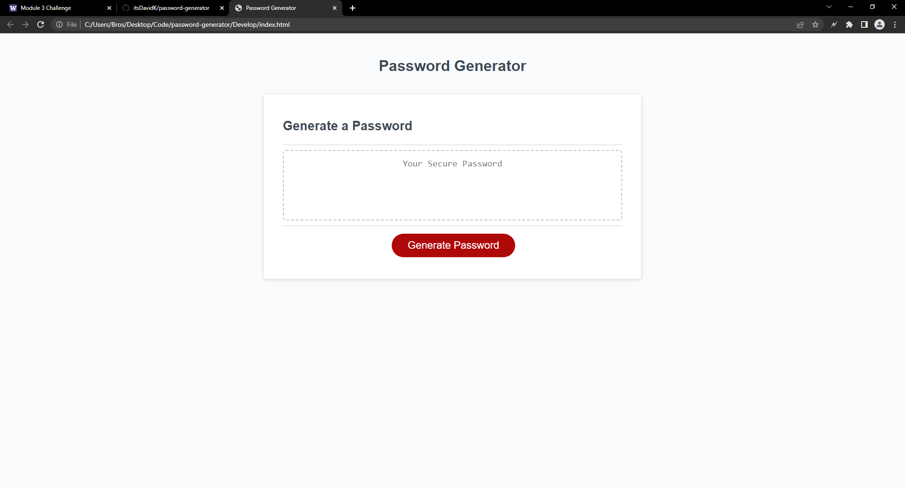
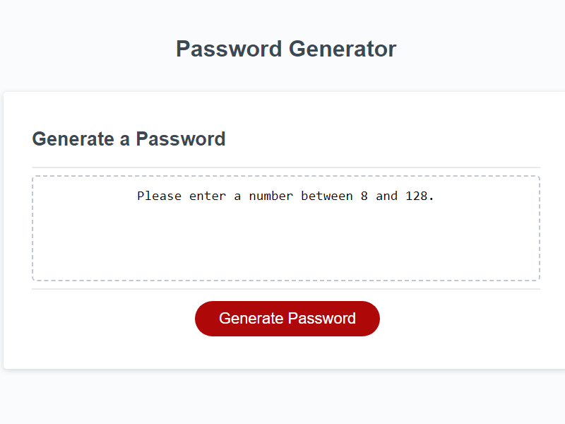
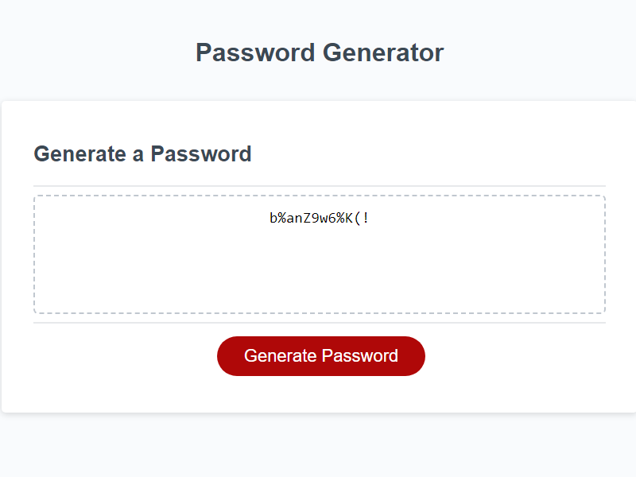

# password-generator
Password-generator is a webpage that creates a randomly generated password for the user. It asks the user whether they want lowercase, uppercase, numbers, and special
characters in their password. The password length goes from 8-128 characters. You can use this webpage to generate multiple passwords without refreshing the page.

## Contributing
Pull requests are welcome. For major changes, please open an issue first to discuss what you would like to change.

Please make sure to update tests as appropriate.

## Website Screenshot

## Link To The Website
https://itsdavidk.github.io/password-generator
